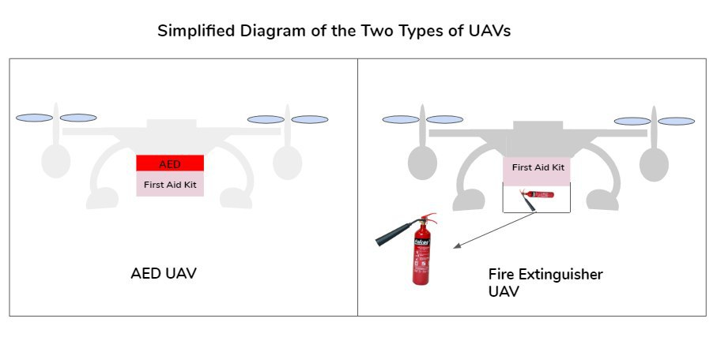

# ROBOCARES Home Monitoring System

## Content
- [Background](#background)
- [Why Robocares?](#why-robocares)
- [Who it helps?](#who-it-helps)
- [What is it?](#what-is-it)
- [How it work?](#how-it-work)

## Background
With Singapore facing an increasingly silver population, there is a larger vulnerable elderly population. These include elderly living alone, those with no next of kin, and those who are mostly alone at home. As Singapore pushes to be a smart nation, important agencies such as the SCDF can better harness the power of technology to respond more effectively to emergencies (e.g. cardiac arrests, falls, unattended cooking fires etc.). Moreover, SCDF can leverage on enhancing and streamlining the process for mobilising Community First Responders (CFRs) for early intervention. These improvements will greatly enhance SCDF's capabilities to save lives.  

## Why Robocares?
### Problems to tackle
1. Distinguishing an emergency from a false alarm to reduce wastage and mobilisation of precious resources.
2. Timely discovery of emergencies, especially for vulnerable populations who spend most of their time at home alone.
3. Analysis and tracking of onsite situation while waiting for the emergency services to arrive.
4. Quicker mobilization of CFRs for effective early and effective intervention, especially for vulnerable populations.
5. Prompt retrieval process of essential resources like fire extinguishers and AEDs to assist CFRs.

### Solution
ROBOCARES Home Monitoring System can help to:
1. determine if the elderly is in an emergency situation.
2. assess the severity of the situation with the use of sensors and a voice chatbot.
3. consistently upload real-time information for analysis by relevant personnels while help is being deployed to the scene.
4. mobilize CFRs in the vicinity early on so that they can provide timely help or resolve any minor emergencies promptly.
5. retrieve essential resources to the scene more quickly, allowing for more timely response from CFRs. CFRs can reduce their journey time to the house as they do not have to worry about getting the resources.

### Technology involved
1. Existing technology
- MyResponder App to alert CFRs.
- Home Fire Alarm Device (HFAD) to detect possible fire cases.
2. Internet of Things (IoT)
- Sensors to obtain readings on motion and voice, to make sense of the situation.
3. Artificial Intelligence
- Voice-enabled Chatbot for further analysis of the situation and obtaining of details from casualty.
4. Data Analytics
- Develop model to predict whether there is an event, as well as type and severity of event, based on readings collected.
- Analyse incidents picked up by ROBOCARES (i.e. accuracy of prediction, time taken for help to arrive, etc) for future enhancements.
5. Unmanned Aerial vehicles (UAVs)
- Deploy essential resources like AED and fire extinguisher to the scene of incident.

## Who it helps?
Examples of vulnerable populations include:
- Elderly with no next of kin, living alone
- People with dementia
– Elderly who are alone at home most of the time (eg. their children are working)

## What is it?

ROBOCARES Home monitoring system consists of a central cloud system linked to multiple devices (ROBOCARES) which are placed around the house.  The system utilises IoT, AI, Data Analytics and Machine Learning. Each ROBOCARE consist of 3 types of sensors and has the HFAD incorporated. These devices are recommended to be placed in locations where the elderly frequent such as the toilets, bedrooms, living room and kitchen. 

Using the sensors, the ROBOCARES Home Monitoring System tells us 3 important pieces of information: (1) Whether there is truly an emergency (2) Type of emergency [if any] (3) Severity of emergency. This allows for better sense-making at the onset of the incident.

The ROBOCARES Home Monitoring System is linked to the MyResponder app, and will activate CFRs depending on the type of event detected. This will be elaborated on further in the later parts of the explanation.

Additionally, two types of Unmanned Aerial Vehicles (UAVs) will be stationed at the void deck of HDB blocks to complement ROBOCARES. The number of UAVs found in each neighbourhood depends on the population density of vulnerable groups in that location. 

## How it works?
### Component 1: ROBOCARES

####  Sensors
ROBOCARES leverages on IoT to obtain readings on various environmental factors, which will be compared against a benchmark to detect abnormalities indicating possible emergencies. It utilises various types of sensors:

1. Volume Sensor
- Purpose: To identify for screams or shouts of help, or sounds of someone collapsing.
- Abnormalities include spikes in volume (screaming, shouting, loud banging or thuds from falls) or sudden disappearance of sounds (unconscious)

2. Frequency (Tone) Sensor
- Purpose: To pickup tones of anxiety, alarm or distress in the elderly's voice.
- Through the use of AI, ROBOCARES can leverage on Voice Match function to recognise the user's voice, and differentiate between the user's voice and other voices (i.e. from electronic gadgets like television, mobile phones, radio). This prevents false alarms, such as screams from movies.

3. Motion sensor
- ROBOCARES uses AI to track the usual distribution of time spent in various parts of the house, and will be alerted when detecting any abnormalities in movement patterns.
- ROBOCARES also dectects if a fall has occurred.

4. HFAD (heat and smoke detector)
- This is the existing SCDF technology which detect fires
- Some flats may already have HFAD installed via the HFAD Assistance Scheme or mandatory installation for new residential flats
- Siren will be activated to alert user and neighbours
- ROBOCARES placed in kitchen will not have the HFAD due to risk of false alarm from cooking smoke
- To detect false alarms, residents will be given 1 minute to deactivate the siren before ROBOCARE concludes that there may be a minor/major fire case

#### Voice Chatbot
If there is a suspected emergency, ROBOCARES will ring for 5 seconds, before activating the Voice Chatbot.
The Voice Chatbot will first ask the elderly: "Is there something wrong? Do you need any help?"
This will be done in a pre-set language or dialect to better cater to each elderly.
ROBOCARES will also be able to detect responses in the selected language or dialect.
Depending on the situation, the required help will be deployed. This will be elaborated further in the explanation below under "Putting it together"

### Component 2: Unmanned Aerial Vehicles (UAVs)
There are two types of UAVs that could be deployed to the scene of incident.

The first type of UAV is the AED UAV, while the second type of UAV is the Fire Extinguisher UAV. 
As the name suggests, the former will carry around an AED, while the latter carries with it an small portable fire extinguisher. Both UAVs will also be equipped with first aid kits. 

Depending on the type of event suspected, the suitable type of UAV will be deployed. This allows the CFRs to head directly to the scene of incident and have the necessary equipment and/or first aid supplies, hence helping the resident more effectively and quickly by eliminating the additional time required to look for and obtain such required resources. 

### Putting it together
Putting Components 1 and 2 together, the following are 3 possible scenarios.
1. Suspected Minor Fire Case
- Indicator: HFAD detects a fire
- Activate Fire Extinguisher UAV
- Activate CFRs on MyResponder App - “Minor Fire’
- Eg. Unattended Cooking Fire

2. Suspected Major Fire Case
- Indicator: HFAD may detect fire before ROBOCARE becomes disconnected (possibly due to damage of ROBOCARE from explosion)
- Activate CFRs on MyResponder App - “Major Incident”
- Eg. Explosion 

3. Suspected Fall/Cardiac Case
- Indicator: Sensors detect abonormalities in motion, volume or tone
- Activate Voice Chatbot
- The Voice Chatbox's flowchart is shown below.

### Component 3: Data Analysis
#### Analysis of indicators of emergencies
To develop the ROBOCARES home monitoring system, past emergencies and non-emergencies will be analysed to obtain a benchmark for the respective indicators (volume, frequency, motion) which will be then used by Component 1 and 2 to make a prediction on whether the incident is an emergency, as well as the type and severity of it.

Information to be presented in database include:
- Volume Sensor’s indicator (Depending on the instrument)
- Volume Sensor - Abnormality? (Y/N)
- Frequency Sensor’s indicator (Depending on the instrument)
- Frequency Sensor - Abnormality? (Y/N)
- Motion Sensor’s indicator (Depending on instrument)
- Motion Sensor - Abnormality? (Y/N)
- HFAD Triggered? (Y/N)
- To Predict: Type of Event (Cardiac Arrest Case, First Aid Case, Minor Fire Case, Major Fire Case)

[A sample of how this database looks like can be seen here.](sensor_info_prediction.csv)

#### Analysis of performance of ROBOCARES
Information from each case will be added into a database and AI will be used to refine the predictions made by the central clouds system to better predict what is the type of event. The database can be analysed to allocate resources eg. UAVs more effectively to areas needed the most. This can help to make future mobilization of CFRs more effective and reduce wastage of precious resources.

Information to be presented in database include:
- Accuracy of predictions
- Time taken for deployment of help

[A sample of how this database looks like can be seen here.](incidents_analysis_info.csv)
