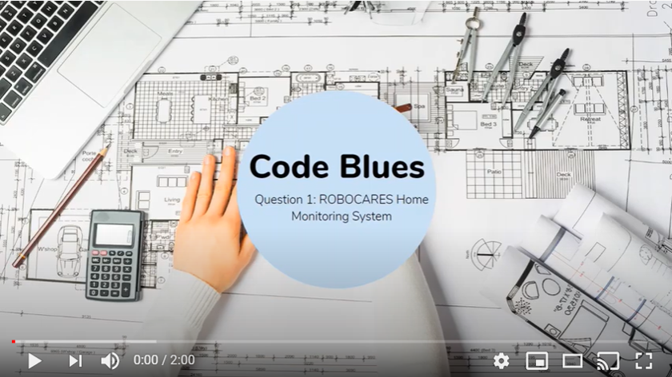
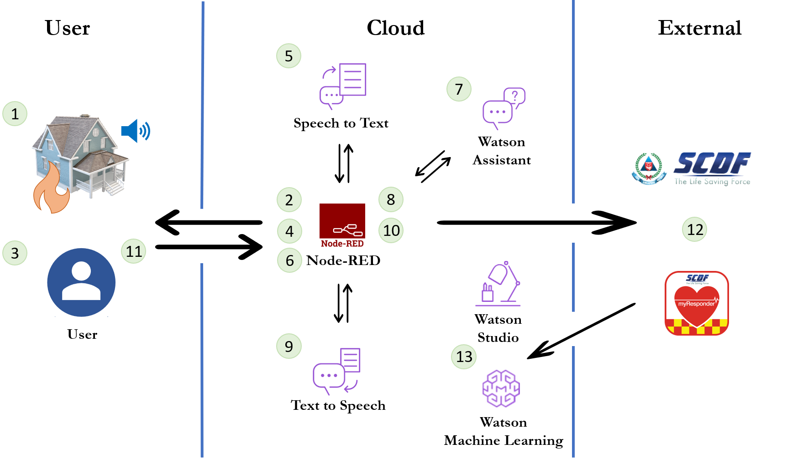

# CodeBlues-RoboCares_SCDFXIBM

## Content
- [The Team](#the-team)
- [Short Description](#short-description)
- [Pitch Video](#Pitch-video)
- [The Architecture](#the-architecture)
- [Detailed Solution Description](#detailed-solution-description)
- [Getting Started](#getting-started)
- [Built With](#built-with)
- [Future Work](#future-work)

## The Team
Our team is called CodeBlues.
Our team members consist of:
- Crystal Teo
- Gini Wong 
- Claire Tang
- Koh Hui Juan

## Short Description
### Problem Statement: Emergency Medical Services
With Singapore facing an increasingly silver population, there is a growing segment of vulnerable elderly population. These include elderly living alone, those with no next of kin, and those who are mostly alone at home. The occurence of emergencies in these homes may be oblivious to the public eye, and help may not arrive until it is too late. 

### How can technology help?
As Singapore pushes to be a smart nation, SCDF can better harness the power of technology to respond more effectively to emergencies (e.g. cardiac arrests, falls, unattended cooking fires etc.). Moreover, SCDF can leverage on enhancing and streamlining the process for mobilising CFRs for early intervention. These improvements will greatly enhance SCDF's capabilities to save lives.

### Idea: ROBOCARES
There is a crucial need for the ability to detect incidents in homes, especially for vulnerable populations. ROBOCARES is a home monitoring system, developed with IBM Cloud and Watson Services. Our system allow for better understanding and prompt alert at the onset of incidents which require emergency response. This in turn enhances the process of mobilising CFRs for effective early intervention.

## Pitch Video

## The Architecture
The following diagram shows the workflow for the NODE_RED voice chatbot that assesses the incidents.

1. Home monitoring system detects potential emergency, rings, and activates voice enabled NODE-RED website with voice chatbot.
2. Chatbot prompts a question to the user to ask if he/she requires help.
3. User gives an answer, 'Yes' or 'No'
4. Node-RED records the speech wav audio format and calls the Watson Speech to Text service hosted in IBM Cloud.
5. Watson Speech to Text uses machine learning to decode the user's speech.
6. Watson Speech to Text replies with a transcript of the answer and Node-RED calls Watson Assistant service hosted in IBM Cloud.
7. Watson Assistant uses natural language understanding and machine learning to extract entities and intents of the user question.
8. Watson Assistant replies to the user inquiry and Node-RED sends the text transcript to Watson Text to Speech.
9. Watson Text to Speech encodes the message in the user's language.
10. Node-RED plays the chat answer .wav file to the user.
11. The user listens to the chat answer.
12. Deploy help from CFRs via myResponder App, or SCDF, where applicable.
13. Collection of data of incidents for future data analysis using Watson Studio and Watson Machine Learning to improve on the system.

## Detailed Solution Description
[More detail is available here](DESCRIPTION.md)

## Getting Started
- Step 1: Create an instance of Watson Assistance and import (this JSON file)[skill-Emergency-Prompt.json] under 'Add dialog skill'. [Here is a preview link of how the chatbot works](https://web-chat.global.assistant.watson.cloud.ibm.com/preview.html?region=kr-seo&integrationID=f7482e44-7291-4c76-bbf2-791a1ca58baa&serviceInstanceID=e8ec789c-8849-4d23-aec0-6ff75ae61177)
- Step 2: Import flow into Node-RED app, and configure Watson Assistant and Watson Speech nodes with new service instances and API Keys. Deploy to launch the dashboard for a preview of the voice-enabled chatbot.
- Step 3: Collect the relevant data required into the databases. IBM Watson Studio will be used to refine the data. AutoAI will be used to analyze the results and create a model. This model will be deployed for its relevant use, to [make a prediction of the incident](Databases/sensor_info_prediction.csv) and to [analyse the performance of ROBOCARES for future enhancements](Databases/incidents_analysis_info.csv).

## Built With
Watson Assistant
Watson Speech to Text
Watson Text to Speech
Node-RED
Watson Studio

## Future Work
### Enhanced voice analysis
The current solution only uses sensors to collect raw data like volume and frequency, and makes its predictions based on collected readings. IBM Cloud services could be used for a deeper analysis and hence improve the quality of predictions. 

For instance, Tone Analyser could be used to predict the emotions of the casualty, hence adding an additional indicator to predict the severity of the situation. Language Translator could be used to understand and response in the various languages and dialects present in Singapore.
